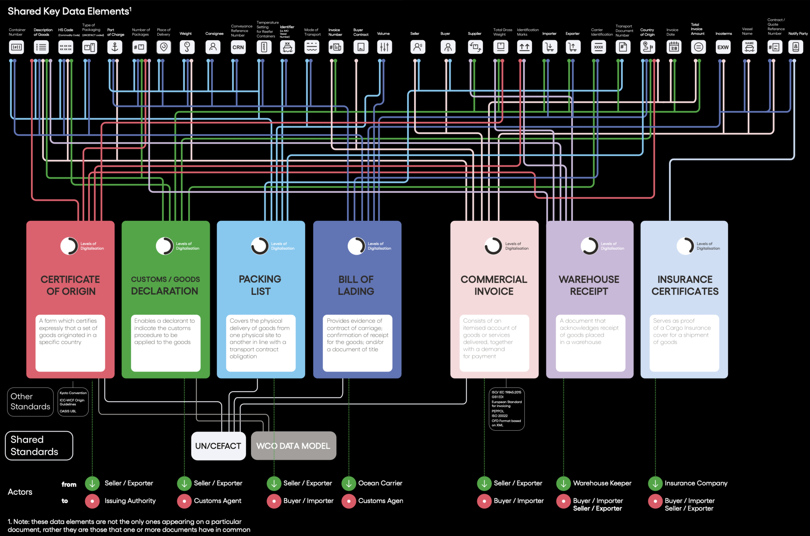

# About

UN/CEFACT Verifiable Trade Documents is an implementation of the logical data models which was created in the 2024 ICC DSI KTDDE project. The UN-VTD physical implementation is specifically targeted issuance of documents as Verifiable Credentials. 

## Background

UN/CEFACT is in a unique position to lead as the world transitions to the next generation of scalable, secure, digital infrastructure, as emergent verifiable credentials and surrounding technologies are adopted by global trade and logistics actors. In embracing this opportunity, the project aims to design and promote a suite of lightweight global trade documents specifically targeted at modern, digitally verifiable web usage.
UN Verifiable Trade Documents will be based on the UN/CEFACT semantic vocabulary and use the rich library of document standards as input. Additionally, the project seeks to leverage the recently published ICC DSI KTDDE as a starting point for what constitutes the minimum set of data elements per document. This will be mutually beneficial for both organizations: ICC DSI does not wish to progress into physical implementations, but will benefit from an international standards body implementing the output of their excellent work. Consequently, it is expected that ICC DSI will be supportive in promoting the UN Verifiable Trade Documents implementation.
UN Verifiable Trade Documents will follow the same technical architecture as the W3C CCG Traceability Vocabulary project, which is supported by US Customs and Border Protection. 

## Approach

The project will prioritize simplicity and recognizability in order to maximize business usage uptake and implementation efficiency. The targeted list of trade documents will be designed for an opinionated modern technology stack, in alignment with the UN/CEFACT technology architecture strategy, prioritizing unambiguity, coherency and interoperability for implementers.

The project will primarily aim to implement the documents which were targeted by the ICC-DSI KTDDE, and roughly targeted in the same batched order; complete coverage of the full set of the 36 KTDDE documents is considered a success criteria.

The KTDDE specification is considered to be a starting point guidance, but the project does not promise to follow the specification strictly. In particular this is because details are often uncovered during implementation which can be difficult to catch in the logical phase.

Similarly, other document types may be included on the premise that they are a generally applicable document commonly exchanged in international trade and transport use cases.

## Scope

The UN Verifiable Trade Documents will be implemented with JSON Schema for defining the core data structures of messages exchanged over API communication. The driving principles at this layer is to a) promote modular data modeling for optimal reuse of components, b) strive for simplicity in the recognition that the targeted user base is heterogeneous and thus the developer and user experience are essential measures of success, and c) adhere to a defined list of design conventions to prevent inconsistent user experiences.

### JSON Schema

One major benefit of JSON Schema is the vast choice of libraries which support it. The trade document schemas will be presented and made available online leveraging such tools. This includes document forms and examples, presented in a way intuitive to a non-technical, business and legislative audience. By consuming the project’s own JSON Schema output, we ensure feasibility, usability and show a practical way for implementers to adopt these UN/CEFACT outputs.

### Linked Data

The trade document schemas will be produced with a corresponding Linked Data context which ensures strong semantics of exchanged documents. This semantic layer will automatically underpin any implementation of the UN/CEFACT schemas; data providers and consumers may freely choose to ignore or leverage it.
The project will take a pragmatic approach to implementing the Linked Data layer; the aim is to annotate meaningful term definitions to document instances, not constructing an elaborate ontology. Similarly, the project does not aim to create any new term definitions, but will leverage existing web vocabularies. The primary vocabulary will be the UN/CEFACT Web Vocabulary, but terms will be pulled in from elsewhere for example if not defined by UN/CEFACT, if another definition is specific, or if it is recognized to be broader adopted.

### Verifiable Credentials

All documents will be modeled following the Verifiable Credentials data model. This ensures that documents can be digitally signed by issuers in a standardized way. The ability to sign data in a vendor-neutral manner is the key to unlock supply chain and trade digitization at global scale.
Beyond adhering to the prevalent Verifiable Credential data model, the project will make recommendations on for example on versioning, signing method, cryptographic suites, and revocation methods with the goal to promote interoperability; on the principle that less ambiguity leads to easier adoption and better interoperability.
